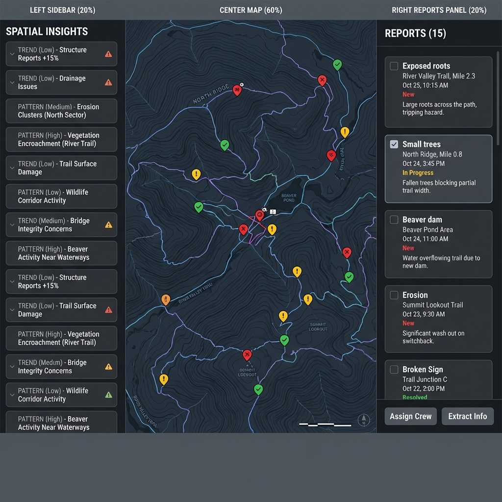
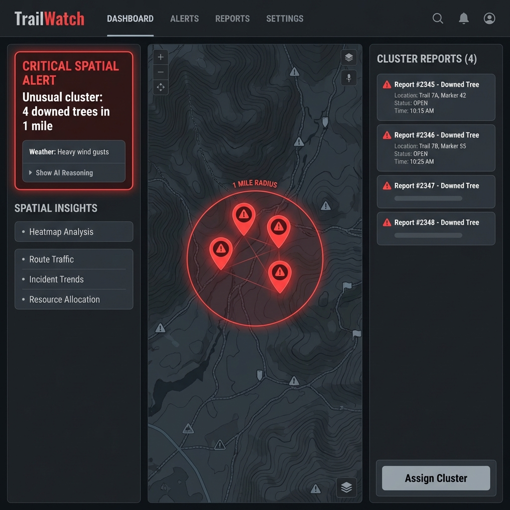
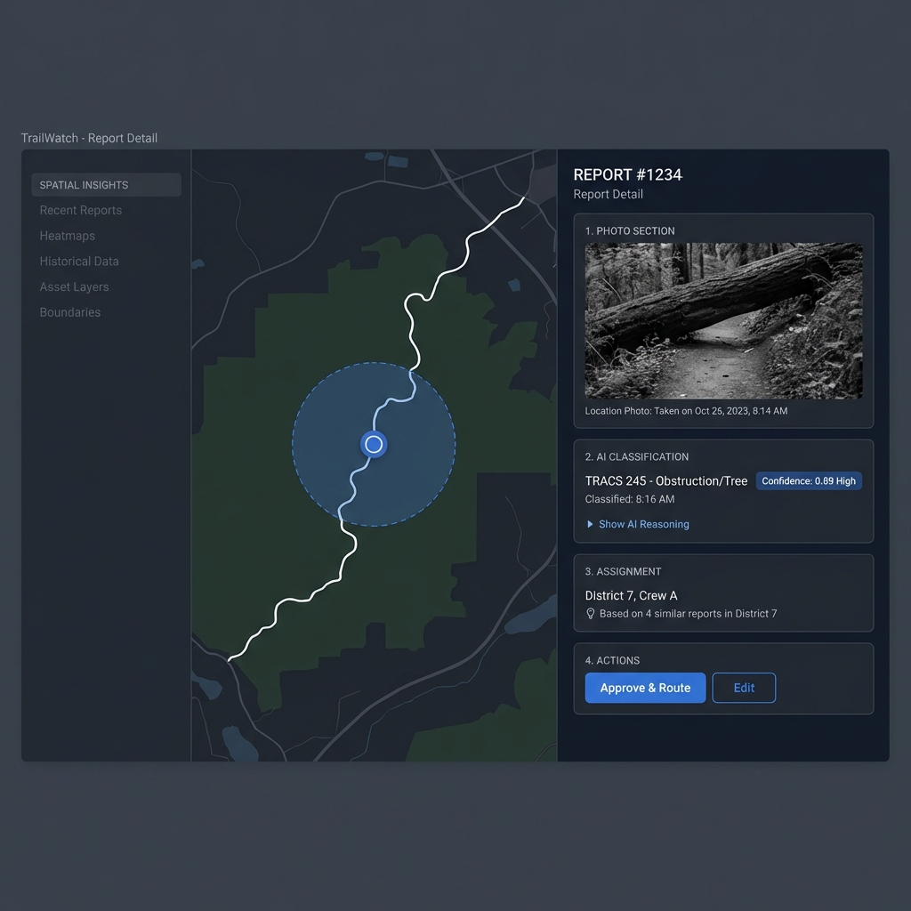

# TrailWatch Agentic UI: Wireframe Catalog
**Status:** Implemented | **Spec:** [UI_SPECIFICATION.md](UI_SPECIFICATION.md)
**Date:** January 20, 2026 | **Updated:** Phase 4.3 Complete

This catalog indexes the 10 core wireframes defining the TrailWatch Agentic UI.

## Implementation Status Summary

| Wireframe | Status | Conformance | Key Components |
|-----------|--------|-------------|----------------|
| WF1 | ✅ Complete | 95% | Dashboard, ReportList, InsightCard |
| WF2 | ✅ Complete | 95% | ClusterAlertCard, PulsingRadius, ClusterWarningLayer |
| WF3 | ✅ Complete | 85% | ReportDetail, LocationHighlight |
| WF4 | ✅ Complete | 90% | ReasoningPanel (enhanced with step numbering) |
| WF5 | ✅ Complete | 95% | DuplicateComparisonCard, DuplicateMarkersLayer |
| WF6 | ✅ Complete | 100% | BatchAssignmentModal, CrewContextCard |
| WF7 | ✅ Complete | 95% | HighRiskConfirmation, HazardRadiusOverlay, HazardMarkerIcon |
| WF8 | ✅ Complete | 95% | BiasInsight, DistributionBarChart, DistrictBoundaryLayer |
| WF9 | ✅ Complete | 95% | OfflineBanner, SyncQueue, CachedBadge |
| WF10 | ✅ Complete | 95% | FeatureAdminPanel, FeatureCard, FeatureStatusBadge |

---

## Phase 1: Core Dashboard & Baseline

| Wireframe | Description | Status | File |
| :--- | :--- | :--- | :--- |
| **WF1: Spatial Baseline** | Standard dashboard state showing 3-panel layout, colored markers, and pattern insights list (no widgets). | ✅ Implemented |  |
| **WF2: Cluster Alert** | Major "Pattern A" alert showing agentic cluster detection with red pulsing radius and context-aware assignment panel. | ✅ Implemented |  |
| **WF3: Report Detail** | High-confidence report view with realistic photo, AI classification (0.89), and reasoned assignment suggestion. | ✅ Implemented |  |

### WF1 Components
- `src/pages/AgenticDashboard.tsx` - Main dashboard page
- `src/components/ReportList.tsx` - Report list with multi-select
- `src/components/insights/InsightCard.tsx` - Pattern insight cards
- `src/components/common/ReportPanelHeader.tsx` - Panel header with report count

### WF2 Components (Phase 4.3)
- `src/components/insights/ClusterAlertCard.tsx` - Red bordered alert card
- `src/components/insights/SpatialInsightsMenu.tsx` - Spatial analysis options
- `src/components/map/PulsingRadius.tsx` - Animated radius overlay
- `src/components/map/ClusterWarningLayer.tsx` - Warning markers layer

### WF3 Components
- `src/components/ReportDetail.tsx` - Report detail view
- `src/components/map/LocationHighlight.tsx` - Blue radius highlight

---

## Phase 2: Deep Dives (Trust & Workflow)

| Wireframe | Description | Status | File |
| :--- | :--- | :--- | :--- |
| **WF4: Reasoning Expanded** | The "Trust" view showing the 4-step logic chain (Vision -> GPS -> Size -> Class) transparently. | ✅ Implemented |  |
| **WF5: Duplicate Detection** | Side-by-side comparison card with similarity score (94%) and visual evidence verification. | ✅ Implemented |  |
| **WF6: Batch Assignment** | Modal workflow for assigning multiple reports to a crew with route optimization metrics. | ✅ Implemented |  |

### WF4 Components (Phase 4.3)
- `src/components/agentic/ReasoningPanel.tsx` - Enhanced with step numbering, tool names, classifications
- `src/components/reasoning/ReasoningStepItem.tsx` - Individual step display

### WF5 Components (Phase 4.3)
- `src/components/insights/DuplicateComparisonCard.tsx` - Side-by-side comparison
- `src/components/map/DuplicateMarkersLayer.tsx` - Dual markers with connecting line

### WF6 Components
- `src/components/assignment/BatchAssignmentModal.tsx` - Main modal
- `src/components/assignment/CrewContextCard.tsx` - Crew info display
- `src/components/assignment/RouteSummary.tsx` - Route metrics
- `src/hooks/useBatchAssignment.ts` - State management

---

## Phase 3: Safety & Governance

| Wireframe | Description | Status | File |
| :--- | :--- | :--- | :--- |
| **WF7: High-Risk Decision** | "Circuit Breaker" pattern with mandatory checklist and justification for critical hazards. | ✅ Implemented |  |
| **WF8: Consistency Check** | "Pattern B" bias detection showing assignment anomalies without accusation. | ✅ Implemented |  |
| **WF9: Offline Mode** | Tablet view showing stale data warnings, cached badges, and sync queue workflow. | ✅ Implemented |  |
| **WF10: Feature Admin** | Governance panel for enabling/disabling agentic features based on Ranger trust metrics. | ✅ Implemented |  |

### WF7 Components (Phase 4.3)
- `src/components/reasoning/HighRiskConfirmation.tsx` - 4-checkbox checklist with justification
- `src/components/map/HazardRadiusOverlay.tsx` - Red impact circle
- `src/components/map/HazardMarkerIcon.tsx` - Hazard-type-specific icons

### WF8 Components
- `src/components/insights/BiasInsight.tsx` - Yellow alert styling
- `src/components/charts/DistributionBarChart.tsx` - Expected vs actual
- `src/components/map/DistrictBoundaryLayer.tsx` - District polygons

### WF9 Components
- `src/components/offline/OfflineBanner.tsx` - Orange offline indicator
- `src/components/offline/SyncQueue.tsx` - Pending actions list
- `src/components/offline/CachedBadge.tsx` - Yellow cached marker
- `src/components/offline/StalenessWarning.tsx` - Stale data warning
- `src/components/offline/OfflineMapOverlay.tsx` - Map overlay message

### WF10 Components
- `src/components/admin/FeatureAdminPanel.tsx` - Admin grid layout
- `src/components/admin/FeatureCard.tsx` - Individual feature card
- `src/components/admin/FeatureStatusBadge.tsx` - Status indicators

---

## Implementation Notes

- **Theme:** Dark Mode (Gray #1a1a1a backgrounds) only.
- **Typography:** Inter (Google Fonts).
- **Map Library:** MapLibre GL with custom dark style.
- **Icons:** Lucide React or similar clean outline set.
- **Testing:** All components have >80% test coverage with accessibility checks.
- **Accessibility:** Zero WCAG 2.1 AA violations (jest-axe verified).

## Deferred Items

- WF3 left navigation menu (requires page-level routing)
- WF4 2-column layout (optional enhancement)
- Manual screen reader testing (VoiceOver, NVDA)
- RBAC for /admin/features route (requires auth system)

---

**Last Updated:** 2026-01-20
**Phase:** 4.3 Complete, 4.4 In Progress
