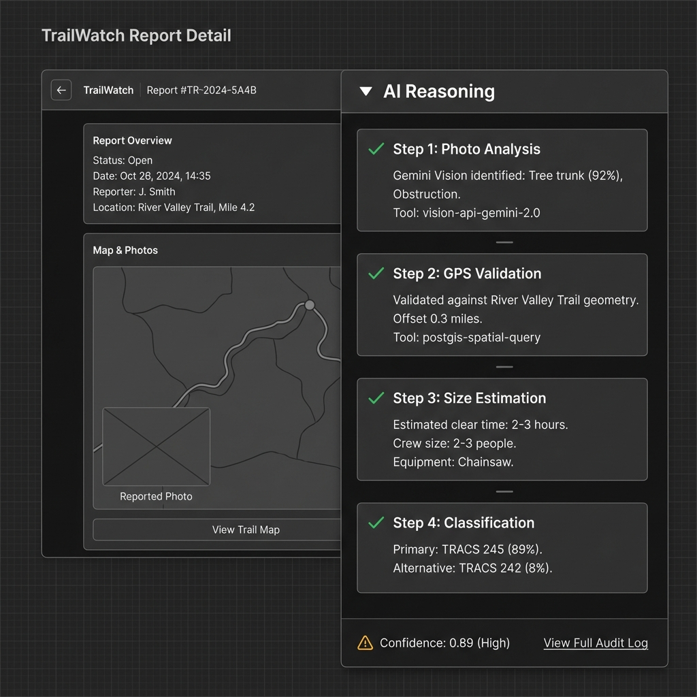
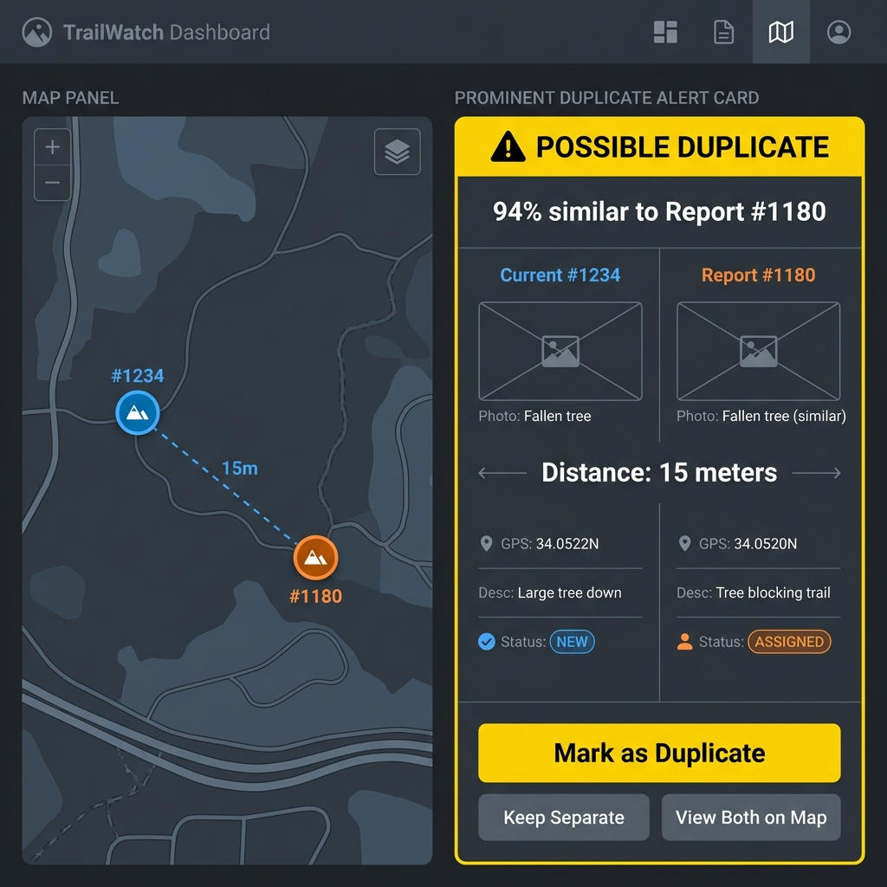
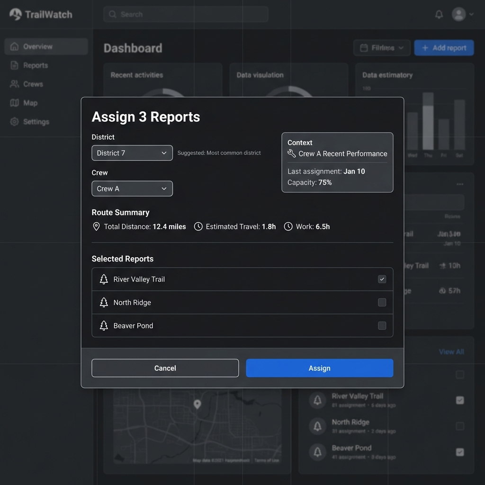
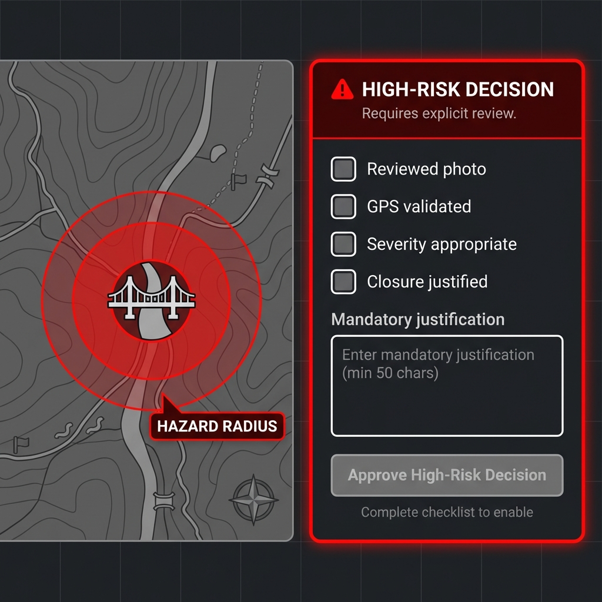
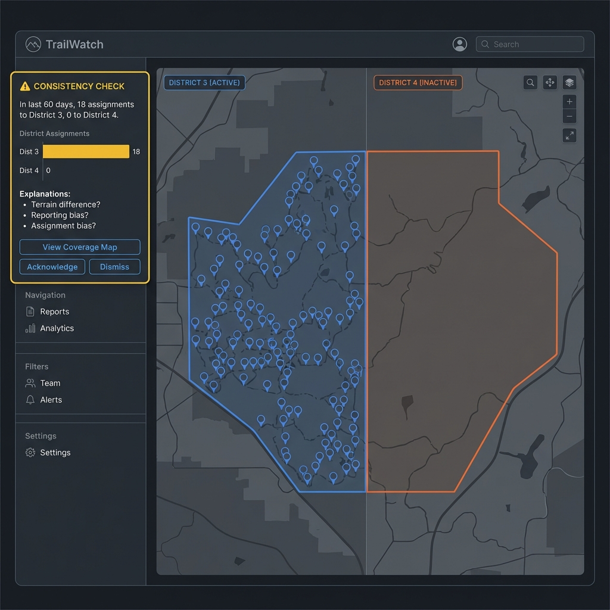
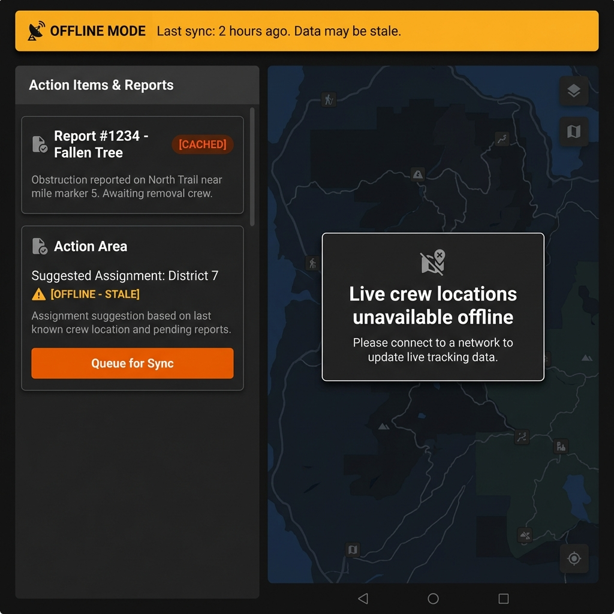
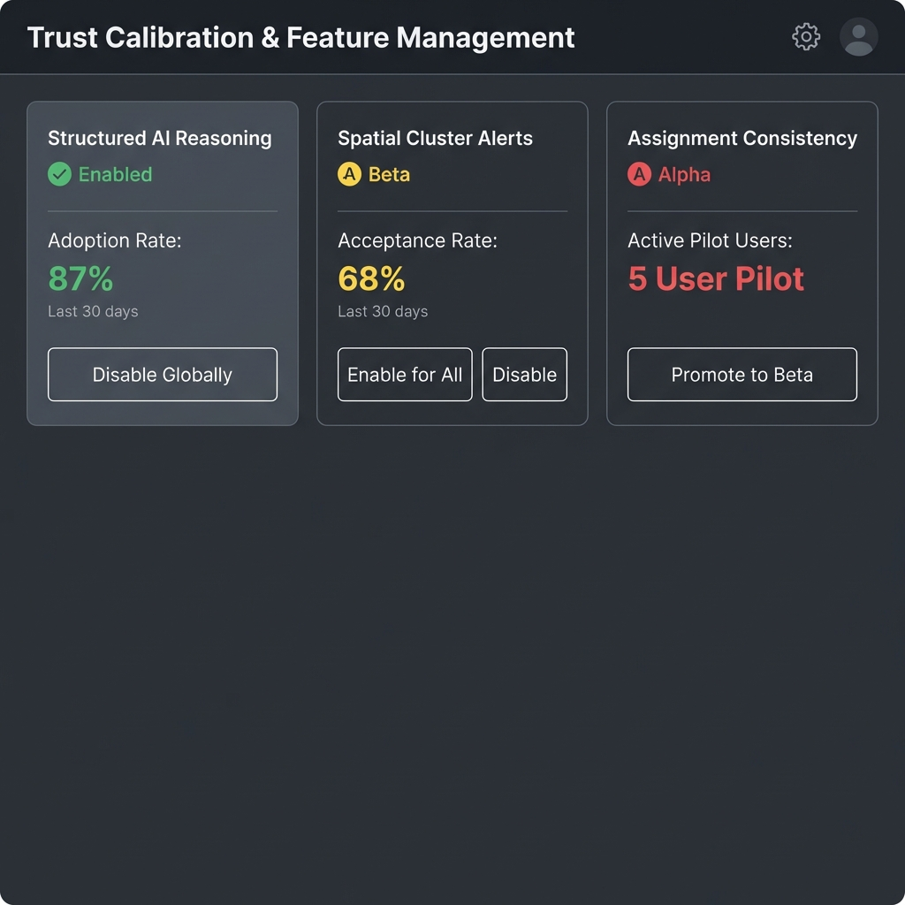

# TrailWatch Agentic UI: Wireframe Catalog
**Status:** Approved for Development | **Spec:** [UI_SPECIFICATION.md](UI_SPECIFICATION.md)
**Date:** January 19, 2026

This catalog indexes the 10 core wireframes defining the TrailWatch Agentic UI.

## Phase 1: Core Dashboard & Baseline
| Wireframe | Description | File |
| :--- | :--- | :--- |
| **WF1: Spatial Baseline** | Standard dashboard state showing 3-panel layout, colored markers, and pattern insights list (no widgets). |  |
| **WF2: Cluster Alert** | Major "Pattern A" alert showing agentic cluster detection with red pulsing radius and context-aware assignment panel. |  |
| **WF3: Report Detail** | High-confidence report view with realistic photo, AI classification (0.89), and reasoned assignment suggestion. |  |

## Phase 2: Deep Dives (Trust & Workflow)
| Wireframe | Description | File |
| :--- | :--- | :--- |
| **WF4: Reasoning Expanded** | The "Trust" view showing the 4-step logic chain (Vision -> GPS -> Size -> Class) transparently. |  |
| **WF5: Duplicate Detection** | Side-by-side comparison card with similarity score (94%) and visual evidence verification. |  |
| **WF6: Batch Assignment** | Modal workflow for assigning multiple reports to a crew with route optimization metrics. |  |

## Phase 3: Safety & Governance
| Wireframe | Description | File |
| :--- | :--- | :--- |
| **WF7: High-Risk Decision** | "Circuit Breaker" pattern with mandatory checklist and justification for critical hazards. |  |
| **WF8: Consistency Check** | "Pattern B" bias detection showing assignment anomalies without accusation. |  |
| **WF9: Offline Mode** | Tablet view showing stale data warnings, cached badges, and sync queue workflow. |  |
| **WF10: Feature Admin** | Governance panel for enabling/disabling agentic features based on Ranger trust metrics. |  |

## Implementation Notes
- **Theme:** Dark Mode (Gray #1a1a1a backgrounds) only.
- **Typography:** Inter (Google Fonts).
- **Map Library:** MapLibre GL with custom dark style.
- **Icons:** Lucide React or similar clean outline set.
