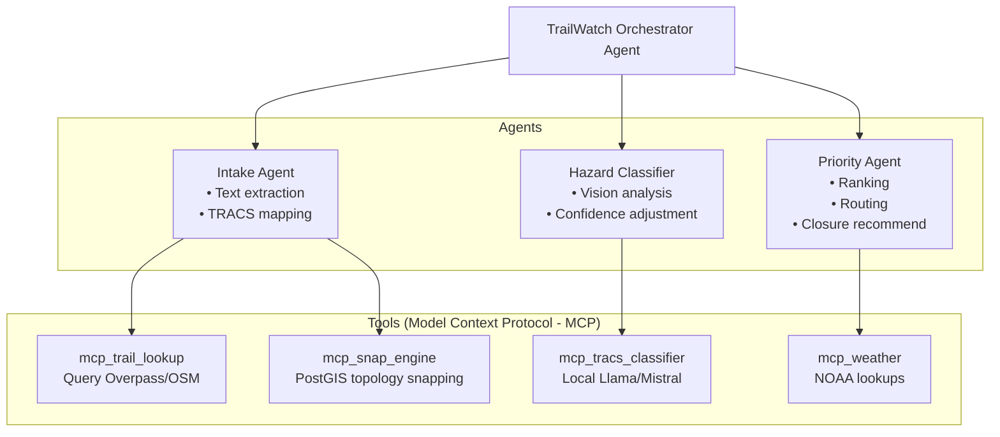

# Agent Architecture (ADK)

The TrailWatch platform uses the Google Agent Development Kit (ADK) for agent orchestration, avoiding LangChain in favor of explicit definitions.

## Orchestrator Pattern

## Tool Definitions

- **mcp_trail_lookup**: Query Overpass/OSM for trailheads
- **mcp_snap_engine**: PostGIS topology snapping
- **mcp_tracs_classifier**: Local Llama/Mistral classification
- **mcp_weather**: NOAA weather lookups
